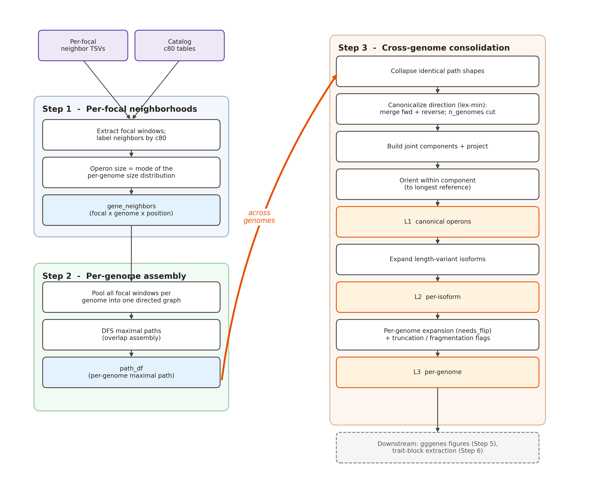

# Worked example - tracing two focals through Steps 1-3

A concrete, end-to-end mental model for how PanSynteny turns per-focal gene
neighborhoods into canonical operons. We follow two focal centroids, **fc1** and
**fc2**, from raw neighborhoods (Step 1) through per-genome assembly (Step 2) to
the cross-genome canonical operons (Step 3).

This is a teaching companion to [STEPS.md](STEPS.md) (the per-function
reference) - read this for the *intuition*, that for the *details*.

> **One-line mental model**
> - **Step 1** - per focal, find its conserved neighborhood across genomes (focal-centered, c80-labeled).
> - **Step 2** - per genome, pool all focal windows into one graph and DFS maximal paths; **overlapping windows merge here** (assembly).
> - **Step 3** - across genomes, dedup identical path shapes -> canonicalize direction -> group c80s into joint components -> re-orient every path within a component to the longest one.




*Process diagram of Steps 1-3 (a detailed companion to the worked example below). Source:* [`figures/walkthrough_flowchart.dot`](figures/walkthrough_flowchart.dot).

## At a glance

PanSynteny turns per-focal gene neighborhoods into **recurrent, co-localized
syntenic gene neighborhoods** shared across genomes. **Step 1** extracts each focal
gene's conserved neighborhood across genomes and labels neighbors by cluster, fixing
the neighborhood size from the *mode* of the per-genome size distribution. **Step 2**
stitches the overlapping focal windows within each genome into one contiguous path by
overlap assembly. **Step 3** merges forward and reverse copies across genomes, groups
related paths into components and orients them consistently, then resolves the
consensus at three nested levels: **L1** (canonical), **L2** (length-variant
isoforms), and **L3** (per-genome, with flip state).

---

## Vocabulary: what Step 2 actually *is*

Step 2 takes many **local, overlapping windows** and merges them (via shared
genes) into **longer contiguous paths**. The best English vocabulary for it, in
order of fit:

- **Stitching** - the codebase's own word (`stitch_paths_across_focal_genes`): joining overlapping pieces edge-to-edge.
- **Assembly / overlap-assembly** - the strongest *analogy*. This is conceptually **OLC genome assembly** (overlap-layout-consensus): each focal neighborhood is a **"read"**, physically overlapping reads **assemble into a "contig"**, and the maximal DFS path is that contig.
- **Tiling** - overlapping windows *tile* the locus; the merged maximal path is a **"tiling path"**.

Recommended one-liner: *"Step 2 stitches overlapping focal neighborhoods into
operon paths - the way overlapping reads assemble into a contig."*

---

## Setup - the toy genome

Genome **G**, chromosome left->right (gene ids `gN`, c80 labels in caps), window
`+/-2`, two focals: **fc1** at `g3` (c80 `FC1`) and **fc2** at `g6` (c80 `FC2`):

```
chrom:   g1   g2   g3    g4   g5   g6    g7   g8
c80:     A    B    FC1   C    D    FC2   E    F
```

The two focal windows **overlap at g4/g5 (= C/D)** - this overlap is what lets
Step 2 stitch them.

---

## Step 1 - per-focal neighborhoods

For each focal, Step 1 extracts a focal-centered window around every occurrence
across genomes, attaches each neighbor's **c80 identity** (coarse + length-variant
fine; synthetic labels for unannotated small ORFs), and keeps the conserved
pattern. Output is `gene_neighbors`: **one row per (focal, genome, position)**.

For genome G:

| gene_member | window (neighbor_gene_id -> c80) |
|---|---|
| g3 (fc1) | g1->A, g2->B, **g3->FC1**, g4->C, g5->D |
| g6 (fc2) | g4->C, g5->D, **g6->FC2**, g7->E, g8->F |

### The operon-size problem, and the density-peak fix

**The problem.** "How many genes is fc1's operon?" has no single answer. The *same*
operon shows up with *different* gene counts genome to genome: some genomes carry
the full cassette, others a truncated copy, others have an extra inserted gene or a
missing annotation that breaks the window. So if you just counted neighbors, fc1's
per-genome sizes might scatter as `..., 10, 11, 12, 12, 12, 13, 7, 18, ...` - a
conserved core buried in noise. A fixed `operon_size` parameter would be wrong for
most genomes; the **mean** gets dragged down by truncated copies and up by expanded
ones; the **max** is just the single most bloated neighborhood.

**The fix: let the genomes vote.** The real operon is the size *most genomes agree
on* - the **mode** of the per-genome size distribution. fc1's `..12,12,12..` cluster
is the conserved cassette; the `7` (truncated) and `18` (expanded) are outliers that
should not define the operon. Step 1 finds that peak and keeps only the genomes
sitting in it, so everything downstream is built from the conserved core rather than
from the noisy tails.

Mechanically (function names in service of that idea, not a substitute for it):

- `compute_operon_size` gives **one size per (focal, genome)** - the count of c80-annotated neighbors at that occurrence. This is the distribution to be voted on.
- `find_most_prevalent_operon_size` -> `compute_selected_bins` smooths that distribution (`density()` = a soft histogram), finds its peaks (`find_peaks`), and takes the **tallest peak as the mode**, keeping sizes at the `floor`/`ceil` of that peak (a narrow band, not a single integer - so `12,12,13` all qualify, `7` and `18` don't).
- Step 1 re-runs orientation + pattern extraction on **only** the focals in that dominant bin, and emits the distribution as `fig3` so you can eyeball whether the peak is clean or the operon is genuinely multimodal.

So fc1's distribution peaking at ~12 keeps its ~12-gene genomes; fc2's peaking at
~10 keeps its ~10-gene genomes - and the truncated/expanded outliers of each are
dropped before they can distort the canonical operon.

---

## Step 2 - per-genome stitching (assembly)

The loop is **per genome, not per focal**: inside one genome it takes **all**
focal windows at once and pools them into a single directed graph.

**(1) Chromosomal positions** per `gene_member` (sort by `neighbor_gene_start`,
anchor = the focal's own row, `position = row_number - anchor_index`):

| gene_member | g1 | g2 | g3 | g4 | g5 | g6 | g7 | g8 |
|---|---|---|---|---|---|---|---|---|
| g3 (fc1) | -2 | -1 | 0 | +1 | +2 | | | |
| g6 (fc2) | | | | -2 | -1 | 0 | +1 | +2 |

**(2) `make_positional_edges`** (consecutive `lead()` within each focal window):

```
fc1:  g1->g2,  g2->g3,  g3->g4,  g4->g5
fc2:                            g4->g5,  g5->g6,  g6->g7,  g7->g8
```

**(3) Pooled `edge_support`** - `group_by(from, to, type)`, count distinct focals:

| from->to | supporting focals | n_support |
|---|---|---|
| g1->g2 | fc1 | 1 |
| g2->g3 | fc1 | 1 |
| g3->g4 | fc1 | 1 |
| **g4->g5** | **fc1, fc2** | **2**  (the overlap) |
| g5->g6 | fc2 | 1 |
| g6->g7 | fc2 | 1 |
| g7->g8 | fc2 | 1 |

**(4) Maximal paths** - the graph is **one weakly-connected component** (`g1..g8`).
DFS from the in-degree-0 source `g1` to the out-degree-0 sink `g8`:

```
maximal path:  g1 -> g2 -> g3 -> g4 -> g5 -> g6 -> g7 -> g8
c80 path:      A  -> B  -> FC1 -> C -> D  -> FC2 -> E -> F     (path_length 8)
```

**One merged operon path containing both focals**, stitched at the shared
`g4->g5` (`C->D`) edge - the only edge with support 2. Nothing "detected" the
overlap explicitly; the windows fused because they shared physical gene nodes,
and DFS walked straight through.

> **Counterfactual:** if fc2 sat far away at `g20`, the two windows would share no
> genes -> two separate components -> two separate paths. Whether they merge is
> pure data-driven physical overlap.

---

## Step 3 - cross-genome consolidation

Step 2 ran on every genome. Suppose across the cohort the collapsed shapes are:

- **P1** `A->B->FC1->C->D->FC2->E->F` (the full merged operon) in **18** genomes
- **P2** `F->E->FC2->D->C->FC1->B->A` (same operon, chromosomally reversed) in **7** genomes
- **P3** `A->B->FC1->C->D` (genomes where fc2 was absent / non-overlapping, so only fc1's window) in **12** genomes

### Stage 1 - collapse across genomes (`collapse_paths_across_genomes`)

Group per-genome paths by `(c80_path_coarse, length, type)` -> one row per shape,
direction **not** yet unified:

| shape | string | length | n_genomes |
|---|---|---|---|
| P1 | `A->B->FC1->C->D->FC2->E->F` | 8 | 18 |
| P2 | `F->E->FC2->D->C->FC1->B->A` | 8 | 7 |
| P3 | `A->B->FC1->C->D` | 5 | 12 |

### Stage 2 - canonicalize direction + survival cut (`generate_canonical_path` / `normalize_path`)

`normalize_path` picks the lex-min of forward vs reverse:

- **P1** forward `A->...` vs reverse `F->...` -> `"A" < "F"` -> keep forward.
- **P2** is P1 reversed; its lex-min is **also** `A->B->FC1->C->D->FC2->E->F`. So **P1 and P2 collapse to one `canonical_path_id`** (`cp_1`), `n_genomes = 18 + 7 = 25`.
- **P3** `A->B->FC1->C->D` (`"A" < "D"`) -> `cp_2`, `n_genomes = 12`.

Apply the `path_min_genomes` gate (say 10): both survive.

| canonical_path_id | canonical string | n_genomes |
|---|---|---|
| cp_1 | `A->B->FC1->C->D->FC2->E->F` | 25 |
| cp_2 | `A->B->FC1->C->D` | 12 |

This is where the **7 reverse-oriented genomes merge** with the 18 forward ones -
the same biological operon, one canonical identity.

### Stage 3 - joint components (`compute_joint_components`)

Build a gene-level undirected graph from **all** canonical paths (consecutive c80
pairs; synthetic small ORFs stripped):

```
cp_1 edges:  A-B, B-FC1, FC1-C, C-D, D-FC2, FC2-E, E-F
cp_2 edges:  A-B, B-FC1, FC1-C, C-D
```

All nodes `{A,B,FC1,C,D,FC2,E,F}` are connected (cp_2 is a sub-path of cp_1) ->
**one joint component**, id `1`. Every c80 here gets `joint_component_id = 1`.

### Stage 4 - project components onto paths (`decorate_paths_with_components`)

Each path inherits the component of its (real) genes -> `joint_component_ids = "1"`
for both cp_1 and cp_2 (single-valued, because all genes of a path are
co-component by construction).

### Stage 5 - orient within component (`orient_paths_within_component`)

Within component 1, paths `{cp_1 (len 8), cp_2 (len 5)}`. Longest (by cleaned
length) = **cp_1 -> reference**. Re-orient cp_2 to maximize contiguous overlap:

- cp_2 forward `A->B->FC1->C->D` matches the prefix of cp_1 -> overlap 5.
- cp_2 reversed `D->C->FC1->B->A` -> overlap ~1.
- `5 > 1` -> do **not** flip. Both already read left-to-right consistently.

This "left-to-right" is within-component consistency seeded by the lex-min tiebreak, **not** 5'->3' of any chromosome - to recover real biological direction, walk back through L3's per-genome `gene_path` to chromosomal coordinates in `path_df` or the original neighbor TSVs.

> **Flip case - when stage 5 *does* reverse a path**
>
> cp_2 above never flipped because, as a clean prefix of cp_1, both lex-min to the
> same direction. A flip happens when a path's stage-2 lex-min points *against* the
> component reference. Minimal example (genes `A..E`, separate from the fc1/fc2
> toy):
>
> - reference **R** = `B->C->D->E` (longest -> reference), reads `D->E` over the shared genes.
> - path **S** physically tiles `D, E, A`. Its lex-min keeps the `A`-first orientation (`"A" < "D"`), so stage 2 *stores* it as `A->E->D` - which reads `E->D` over the shared genes, i.e. **opposite** to R.
>
> Stage 5 compares contiguous overlap of S against R:
>
> | S orientation | shared run vs R `...D->E` | overlap |
> |---|---|---|
> | forward `A->E->D` | `E->D` (mismatched direction) | ~1 |
> | reversed `D->E->A` | `D->E` (aligned) | 2 |
>
> `2 > 1` -> **flip S** to `D->E->A`. Now both read left-to-right consistently, and
> every genome that contributed S inherits `needs_flip = TRUE` in L3 (its
> `gene_path_canonical` is the `rev()` that restores component-consistent order).

### Stage 6 - bake `uid`

```
cp_1:  uid = cmp1-pos-cp_1-ng25     (the full fc1+fc2 operon, 25 genomes)
cp_2:  uid = cmp1-pos-cp_2-ng12     (the shorter fc1-only sub-operon, 12 genomes)
```

These are the two **L1 canonical operons**.

### Stage 7 - per-isoform expansion (`expand_canonical_paths_to_fine`)

Suppose within cp_1's 25 genomes, gene **C** is observed at two lengths -> fine
labels `C_2` (long, 18 genomes) and `C_1` (short, 7 genomes). cp_1 expands into
two **L2 isoforms**:

| uid_fine | fine string | n_fine_genomes |
|---|---|---|
| cmp1-pos-cp_1-ng25-**iso1**-ngf18 | `A->B->FC1->C_2->D->FC2->E->F` | 18 |
| cmp1-pos-cp_1-ng25-**iso2**-ngf7 | `A->B->FC1->C_1->D->FC2->E->F` | 7 |

(`isoform_rank` is by descending `n_fine_genomes`.)

### Stage 8 - per-gene expansions + decorators + L3

- **L1 c80s** - cp_1 split into 8 per-gene rows (`A,B,FC1,C,D,FC2,E,F`), coarse metadata, `neighbor_gene_length` = max-over-isoforms.
- **L2 fine c80s** - per-isoform rows. `decorate_c80s_w_truncation` (fine only) flags `C_1` as `is_truncated` if its length `< truncation_cutoff x` the cluster reference length. (Not `is_fragmented` here - that needs `C_1` and `C_2` in the *same* operon path; they live in different isoforms.)
- **L3 per-genome** - one row per (canonical, genome). The **7 reverse-oriented genomes** (originally P2) carry `needs_flip = TRUE`; their `gene_path_canonical` is the `rev()` that brings them back to `A->B->FC1->C->D->FC2->E->F` order, while `gene_path` keeps the raw chromosomal order.

---

## End-to-end summary

| Stage | What happened to our example |
|---|---|
| Step 1 | fc1 and fc2 each get a conserved, c80-labeled neighborhood; dominant size set by the density peak. |
| Step 2 | In each genome, the fc1 and fc2 windows **stitch** at the shared `C->D` overlap into one path `A->B->FC1->C->D->FC2->E->F`. |
| Step 3.1-2 | Across genomes, identical shapes dedup; forward + reverse genomes **merge** into one canonical operon `cp_1` (25 genomes); a shorter fc1-only `cp_2` (12) also survives. |
| Step 3.3-5 | Both land in **one joint component**; cp_1 (longest) is the orientation reference. |
| Step 3.6-8 | `uid`s baked; cp_1 splits into 2 length **isoforms** (C_1/C_2); per-genome L3 records direction via `needs_flip`. |

The single misconception to avoid: **Step 2 is the assembly step.** Overlapping
focal windows do not stay separate - they fuse, via shared physical genes, into
one per-genome operon path. Everything cross-genome (dedup, direction, isoforms)
is Step 3.
